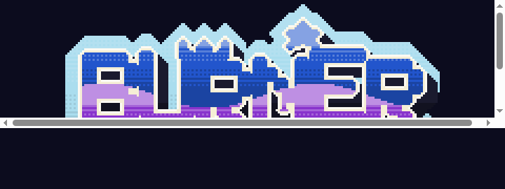

  

<h3 align="center">An 8-bit graffiti arcade game. The Bronx, 1986.</h3>

  <strong><a href="https://burn.mreider.com">▶ PLAY</a></strong>

  <code>&lt; &gt;</code> move · <code>^ v</code> cans · <code>X</code> spray · <code>SPACE</code> jump · <code>H</code> hide

  Get up. Stay up. Tonight's kings reset at midnight, New York time.

  <a href="https://github.com/KuvopLLC/burner/issues">Bugs & ideas</a> · <a href="docs/DEV.md">Dev notes</a>

© 1986 KUVOP

